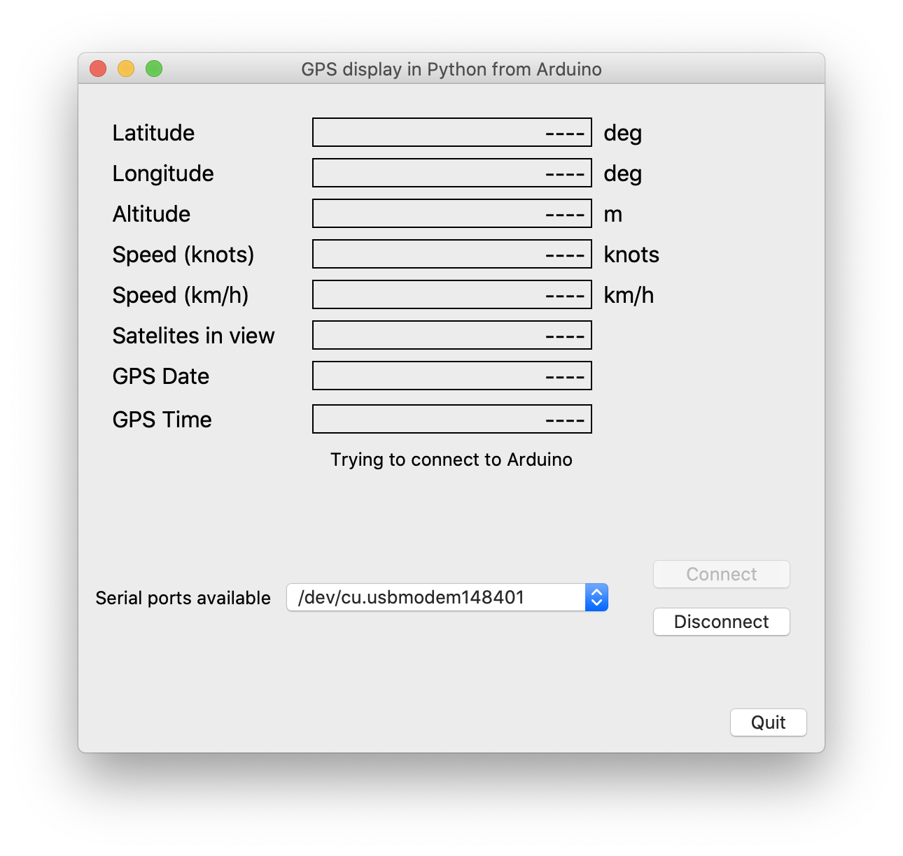
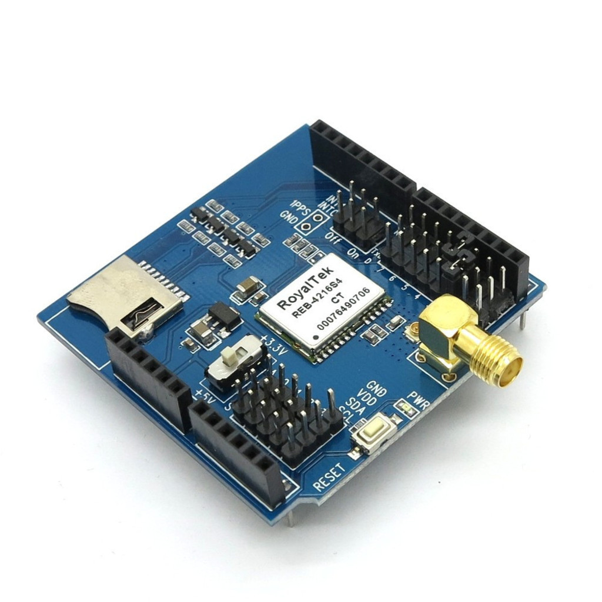
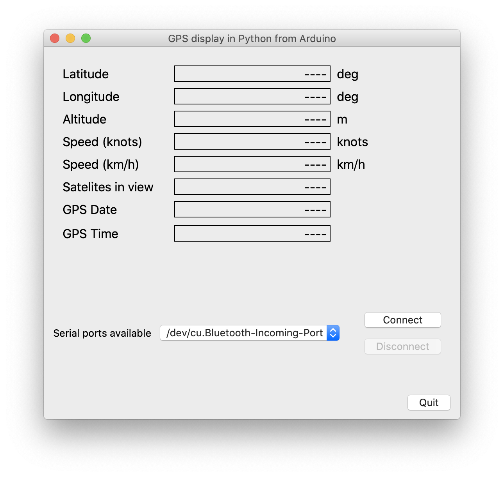
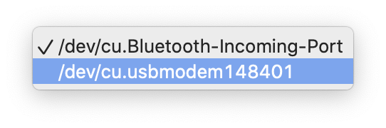

# arduino-pyQT-GPSbasic
Reading GPS location data using Arduino UNO with one way data communications to macOS via serial connection (USB) with final on screen display using Python and pyQT.

Items you will need (Hardware)
* Arduino UNO board
* Grove base Shield
* Grove-LCD RGB
* RoyalTek GPS shield

Once the hardware is assembled then use the Arduino IDE (current version can be found at [IDE](https://www.arduino.cc/en/software)) to compile and upload to Arduino board attached to your computer via USB cable.

If you then open the Serial Monitor from the Arudino IDE you will see the information being read from the GPS receiver.

Then fire up Python on your computer and load the GPSviewer.py file. Once it is run the window should appears as;

Next select the correct serial port from the dropdown list;

and click CONNECT.

This will take some time and will not progress unless the GPS receiver can locate at least 4 satellites.

Please feel free to use/modify to your hearts content. The code is not the prettiest or the best and I in no way claim to be a programmer (It's just a hobby). If you think you can improve it, please go ahead.

